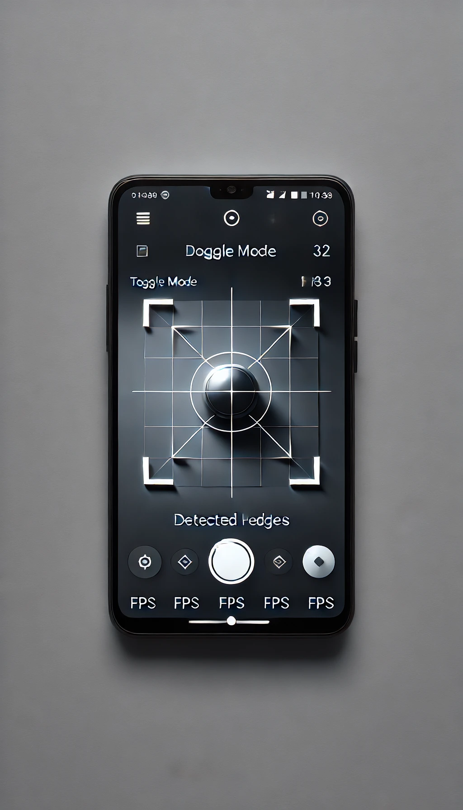

# 📱 Real-Time Edge Detection  
### Android + OpenCV (JNI) + OpenGL ES + TypeScript Web Viewer


A high-performance real-time **edge detection** system using:
- Android Camera2 API  
- OpenCV (C++ via JNI)  
- OpenGL ES rendering  
- A TypeScript Web Viewer for demo/visualization  

---

# 🚀 Features

## ✅ **Android App**
- Real-time camera feed (Camera2 API)
- YUV_420_888 → NV21 fast conversion
- OpenCV (C++) pipeline:
  - NV21 → BGR
  - BGR → Gray
  - Gray → **Canny Edge Detection**
  - Output → RGBA
- Smooth OpenGL ES texture rendering
- Toggle: **Edges ↔ Grayscale**
- 30–60 FPS optimized flow

## 🌐 **Web Viewer**
- Simple TypeScript + HTML viewer
- Displays edge-detected frames
- Works with static or streamed input

---

# 📷 Screenshots


### 🟦 Grayscale Mode  
### 🟩 Edge Detection Mode  
### 🌐 Web Viewer  

---

# ⚙ Setup Instructions

## 1️⃣ Requirements
- Android Studio (latest)
- NDK + CMake  
  *(Android Studio → SDK Manager → SDK Tools)*
- OpenCV Android SDK  
  Download: https://opencv.org/releases/

---

## 2️⃣ Add OpenCV `.so` Libraries

#### From OpenCV SDK: 
- opencv/sdk/native/libs/<abi>/libopencv_java4.so
#### To your project:
- app/src/main/jniLibs/<abi>/libopencv_java4.so
#### Example:
- app/src/main/jniLibs/arm64-v8a/libopencv_java4.so

---

## 3️⃣ CMake Configuration

In `app/CMakeLists.txt`:

```cmake
set(OpenCV_DIR ${CMAKE_SOURCE_DIR}/../opencv/sdk/native/jni)
find_package(OpenCV REQUIRED COMPONENTS core imgproc)
```
---
# 4️⃣ Build & Run
* Open project in Android Studio
* Connect Android device
* Run the app
* Toggle Edges / Grayscale
---
# 🧠 Architecture Overview
### 1️⃣ Camera2 Layer
* Captures YUV_420_888 frames
* Converts to NV21
* Sends bytes to JNI
### 2️⃣ JNI → C++ (OpenCV)
* Processing flow:
* NV21 → BGR → Grayscale → (Canny) → RGBA
### 3️⃣ OpenGL ES Renderer
* Receives RGBA buffer
* Uploads as texture
* Draws full-screen quad via shaders
### 4️⃣ TypeScript Web Viewer
* Renders processed frames
* Extendable (WebSocket, HTTP stream, etc.)
